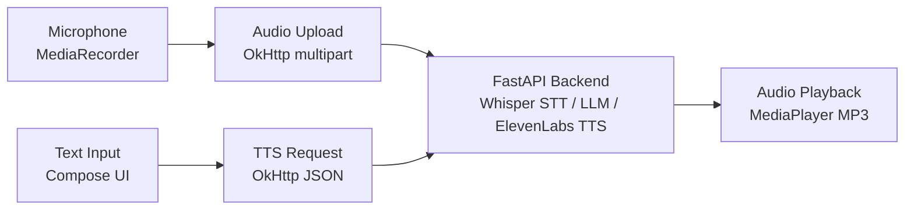

# android

> AI-powered voice interaction client for Android — Jetpack Compose front-end that captures microphone input, sends it to an AI pipeline (Whisper STT, LLM reasoning, ElevenLabs TTS), and plays back synthesised speech responses.

[](https://github.com/OgeonX-Ai/android/actions/workflows/ci.yml)
[](https://kotlinlang.org)
[](LICENSE)

[](https://github.com/Coding-Autopilot-System)

Part of the [Coding-Autopilot-System](https://github.com/Coding-Autopilot-System) ecosystem: [gsd-orchestrator](https://github.com/Coding-Autopilot-System/gsd-orchestrator) | [Promptimprover](https://github.com/Coding-Autopilot-System/Promptimprover) | [autogen](https://github.com/Coding-Autopilot-System/autogen)

**See also:** [OgeonX-Ai/enterprise-ai-gateway](https://github.com/OgeonX-Ai/enterprise-ai-gateway) — vendor-agnostic AI service bus

## Architecture



The app provides two interaction paths. Voice input: the user records audio via `MediaRecorder`, which is uploaded as a multipart M4A file to the FastAPI backend. The backend transcribes speech (Whisper STT), generates a response (LLM), synthesises audio (ElevenLabs TTS), and returns an MP3 stream. Text input: the user types a message and selects a voice persona; the app sends a JSON request to the backend, which returns synthesised speech. Both paths end with `MediaPlayer` playback of the MP3 response.

## Features

- **Voice capture** — `MediaRecorder` M4A audio with runtime permission handling
- **AI voice pipeline** — microphone input to Whisper STT to LLM reasoning to ElevenLabs TTS
- **Text-to-speech** — text input with selectable voice personas (Kim, Milla, John, Lily)
- **Jetpack Compose UI** — Material 3 interface with gradient background, voice dropdown, and action buttons
- **FastAPI backend** — included Python backend with Whisper, Hugging Face LLM, and ElevenLabs integrations
- **JVM unit tests** — `MainActivityTest` validating backend URL configuration and voice list integrity

## Quick Start

```bash
git clone https://github.com/OgeonX-Ai/android.git
```

1. Open the project in Android Studio
2. Set `backendUrl` in `MainActivity.kt` to your FastAPI backend endpoint
3. Start the backend: `cd backend && pip install -r requirements.txt && uvicorn main:app --port 8000`
4. Run on a device or emulator (min SDK 26 / Android 8.0)

---

Part of the [Coding-Autopilot-System](https://github.com/Coding-Autopilot-System) ecosystem: [gsd-orchestrator](https://github.com/Coding-Autopilot-System/gsd-orchestrator) | [Promptimprover](https://github.com/Coding-Autopilot-System/Promptimprover) | [autogen](https://github.com/Coding-Autopilot-System/autogen)
